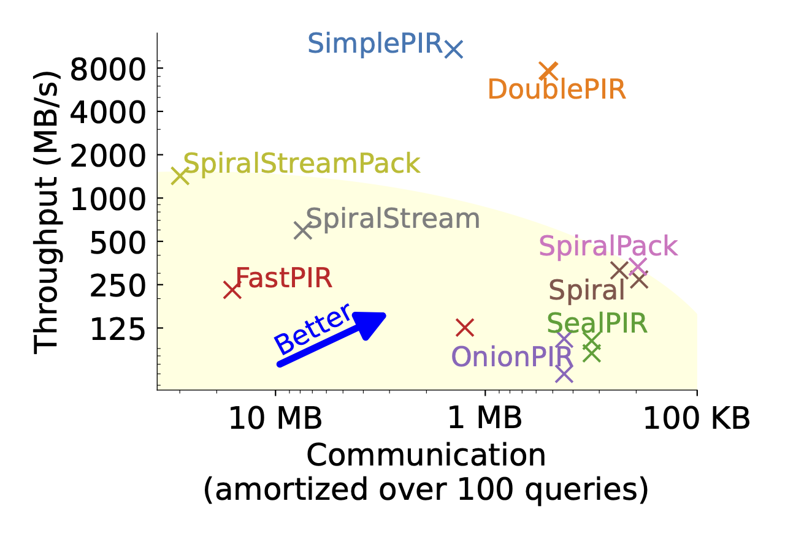

# One Server for the Price of Two: Simple and Fast Single-Server Private Information Retrieval

This repository contains the code for SimplePIR and DoublePIR, two high-throughput single-server PIR schemes presented in the paper ["One Server for the Price of Two: Simple and Fast Single-Server Private Information Retrieval"](https://eprint.iacr.org/2022/949) by Alexandra Henzinger, Matthew M. Hong, Henry Corrigan-Gibbs, Sarah Meiklejohn, and Vinod Vaikuntanathan.

**Warning**: This code is a research prototype.

> We present SimplePIR, the fastest single-server private information retrieval scheme known to date. SimplePIR’s security holds under the learning-with-errors assumption. To answer a client’s query, the SimplePIR server performs fewer than one 32-bit multiplication and one 32-bit addition per database byte. SimplePIR achieves 10 GB/s/core server throughput, which approaches the memory bandwidth of the machine and the performance of the fastest two-server private-information-retrieval schemes (which require non-colluding servers). SimplePIR has relatively large communication costs: to make queries to a 1 GB database, the client must download a 121 MB "hint" about the database contents; thereafter, the client may make an unbounded number of queries, each requiring 242 KB of communication. We present a second single-server scheme, DoublePIR, that shrinks the hint to 16 MB at the cost of slightly higher per-query communication (345 KB) and slightly lower throughput (7.4 GB/s/core).

SimplePIR and DoublePIR's performance, compared to other single-server PIR schemes, on a 1 GB database:
> 

## Overview

This directory contains the reference implementation of SimplePIR and DoublePIR, including their extensions to support databases with long records and batch queries (see sections 4.3 and 5.2 in the paper). Our code uses a single thread of execution.

The `pir/` directory contains the code for SimplePIR and DoublePIR. In particular, it contains the files:
- `pir.go`, which defines the interface for a PIR with preprocessing scheme, and `simple_pir.go` and `double_pir.go`, which implement SimplePIR and DoublePIR.
- `pir_test.go`, which contains correctness tests and performance benchmarks for the SimplePIR and DoublePIR implementations. Our performance benchmarks run on random databases and skip the preprocessing step (i.e., they use randomly generated hints) to speed up their execution time. On the other hand, our correctness tests run on random databases, perform the full preprocessing step, and check that the PIR outputs are correct.   
- `pir.h` and `pir.c`, which implement matrix multiplication and transposition routines.
- `matrix.go`, which implements other matrix operations.
- `database.go`, which implements operations on databases to transform them to the format used by SimplePIR and DoublePIR.
- `params.csv`, which contains the learning-with-errors parameters used in this work.

The `eval/` directory contains scripts to generate Figure 9 from the paper. 

## Setup

To run the SimplePIR and DoublePIR code, install [Go](https://go.dev/) (tested with version 1.19.1) and a C compiler (tested with GCC 11.2.0). To obtain our performance numbers, we run our benchmarks on an AWS EC2 `c5n.metal` instance running Ubuntu 22.04. 

To produce the plots, additionally install [Python 3](https://www.python.org/downloads/), [NumPy](https://numpy.org/) and [Matplotlib](https://matplotlib.org/).

## Usage

To run all SimplePIR and DoublePIR correctness tests, run 
```
cd pir/
go test
cd ..
``` 
The correctness tests execute SimplePIR and DoublePIR on random databases of various, fixed dimensions, and check that the PIR output is correct. While executing, the tests log performance information to the console (namely, the communication costs and the server throughput). The test suite should take approximately 3 minutes to complete, and prints logging output that indicates whether all tests have passed.

To analytically compute SimplePIR and DoublePIR's communication on a database of $2^n$ entries, each consisting of $d$ bits, run 
```
cd pir/
LOG_N=n D=d go test -run=BW
cd ..
```

To benchmark SimplePIR and DoublePIR's performance on a database of $2^n$ entries, each consisting of $d$ bits, run 
```
cd pir/
LOG_N=n D=d go test -bench PirSingle -timeout 0 -run=^$
cd ..
``` 
(SimplePIR's maximal throughput is achieved with $n = 22$ and $d = 2048$.) The command will run SimplePIR and DoublePIR 5 times on a database of the given size, and print logging information including the communication and the server throughput measured on each execution. To run SimplePIR and DoublePIR on a 1 GB database of 1-bit entries, we take `LOG_N=33 D=1`. This benchmark should take approximately 10 minutes to complete.

To benchmark SimplePIR and DoublePIR's performance on a database of $2^n$ entries, each consisting of $d$ bits, with batches of queries of increasing size, run 
```
cd pir/
LOG_N=n D=d go test -bench PirBatch -timeout 0 -run=^$
cd ..
``` 

To produce a plot of SimplePIR and DoublePIR's throughput with increasing batch sizes, first run the command above to benchmark the schemes' performance on a database of the desired size. Then, run
```
cd eval/
python3 plot.py -p batch_tput -f ../pir/simple-batch.log ../pir/double-batch.log -n SimplePIR DoublePIR
cd ..
```

For an example of how to call the SimplePIR and DoublePIR methods from code, see the `RunPIR` and `RunPIRCompressed` functions in the file `pir/pir.go`. To call the SimplePIR and DoublePIR methods from Go code, import the package `"github.com/ahenzinger/simplepir/pir"`. 


## Citation

```
@inproceedings{cryptoeprint:2022/949,
      author = {Alexandra Henzinger and Matthew M. Hong and Henry Corrigan-Gibbs and Sarah Meiklejohn and Vinod Vaikuntanathan},
      title = {One Server for the Price of Two: Simple and Fast Single-Server Private Information Retrieval},
      booktitle = {32nd USENIX Security Symposium (USENIX Security 23)},
      year = {2023},
      address = {Anaheim, CA},
      url = {https://www.usenix.org/conference/usenixsecurity23/presentation/henzinger},
      publisher = {USENIX Association},
      month = aug,
}
```
